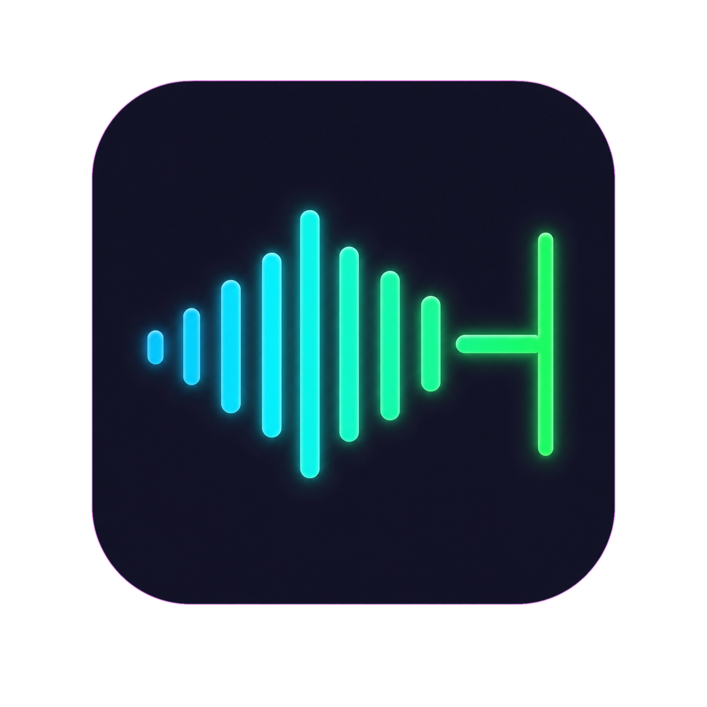

<div align="center">
  
  <h1>LocalWhisper</h1>
  <p><strong>A fully local, privacy-first AI voice dictation app powered by Whisper + Gemma 3.</strong></p>
  <p>No cloud. No subscription. One-time purchase.</p>

  <p>
    <a href="https://github.com/CYTE-LAB/localwhisper/blob/main/LICENSE"></a>
    <a href="https://tauri.app/"></a>
    <a href="https://www.rust-lang.org/"></a>
  </p>
</div>

## What is LocalWhisper?

LocalWhisper is an AI-powered voice dictation application that runs entirely on your local machine. It captures your speech, transcribes it with unparalleled accuracy using `whisper.cpp`, polishes the text with Google's `Gemma 3 1B` model, and instantly types the result wherever your cursor is.

**It's designed to be the open-source, buy-once alternative to subscription-based tools like Typeless or Wispr Flow.**

### Why LocalWhisper?

- **100% Privacy-First**: All AI models (Whisper + Gemma 3) run locally on your device. Your voice and data never leave your computer.
- **No Subscriptions**: Pay once, own it forever. No monthly API fees, no token limits.
- **Zero Latency**: By embedding `whisper-rs` and `llama-cpp-4` directly into the Rust process, we eliminate cold starts and network latency. End-to-end response time is typically under 1.5 seconds.
- **Context-Aware Polishing**: It doesn't just transcribe — it removes filler words, fixes grammar, and formats text based on context.

## Quick Start

### Prerequisites

- [Rust](https://www.rust-lang.org/tools/install) (1.80+)
- [Node.js](https://nodejs.org/) (20+)
- [pnpm](https://pnpm.io/) (`npm install -g pnpm`)
- C++ Build Tools:
  - macOS: `xcode-select --install`
  - Windows: Visual Studio Build Tools
  - Linux: `sudo apt install build-essential cmake`

### Installation

```bash
# Clone the repository
git clone https://github.com/CYTE-LAB/localwhisper.git
cd localwhisper

# Install frontend dependencies
pnpm install

# Download AI models (~2.1 GB total)
./scripts/download-models.sh

# Run in development mode
pnpm tauri dev
```

### Manual Model Download

If the script doesn't work, download manually:

```bash
mkdir -p src-tauri/models

# Whisper Large V3 Turbo (~1.5 GB)
curl -L -o src-tauri/models/ggml-large-v3-turbo.bin \
  https://huggingface.co/ggerganov/whisper.cpp/resolve/main/ggml-large-v3-turbo.bin

# Gemma 3 1B IT Q4_K_M (~650 MB, optional — for text polishing)
curl -L -o src-tauri/models/gemma-3-1b-it-Q4_K_M.gguf \
  https://huggingface.co/bartowski/gemma-3-1b-it-GGUF/resolve/main/gemma-3-1b-it-Q4_K_M.gguf
```

## Architecture

LocalWhisper is built with a **Tauri + React** stack, optimized for maximum performance and minimal memory footprint.

| Layer | Technology | Purpose |
|-------|-----------|---------|
| Frontend UI | React + TypeScript + TailwindCSS | Settings, onboarding, status display |
| Desktop Framework | Tauri v2 (Rust) | App shell, IPC, global shortcut |
| Audio Capture | `cpal` | Microphone recording + mono resampling |
| STT Engine | `whisper-rs` (embedded `whisper.cpp`) | Speech-to-text |
| LLM Engine | `llama-cpp-4` (embedded `llama.cpp`) | Text polishing |
| Keyboard Output | `enigo` | Simulate typing into active window |

```
┌─────────────────────────────────────────────┐
│              Tauri App Process               │
├─────────────────────────────────────────────┤
│  ┌─────────┐   ┌──────────┐   ┌─────────┐  │
│  │  cpal   │──▶│ whisper- │──▶│ llama-  │  │
│  │ (audio) │   │ rs (STT) │   │ cpp-4   │  │
│  └─────────┘   └──────────┘   │ (polish)│  │
│                                └────┬────┘  │
│                                     │       │
│                              ┌──────▼─────┐ │
│                              │   enigo    │ │
│                              │ (keyboard) │ │
│                              └────────────┘ │
├─────────────────────────────────────────────┤
│           React + Tailwind UI               │
└─────────────────────────────────────────────┘
```

For a deep dive into the technical design, please read [docs/DESIGN.md](docs/DESIGN.md).

## Project Structure

```
localwhisper/
├── src-tauri/
│   ├── src/
│   │   ├── main.rs          # Entry, state, commands, shortcut registration
│   │   ├── audio.rs         # Microphone capture + resampling to 16kHz
│   │   ├── pipeline.rs      # State machine (Record → Transcribe → Polish → Type)
│   │   ├── settings.rs      # Persistent settings (JSON)
│   │   └── inference/
│   │       ├── mod.rs       # Model path resolution
│   │       ├── whisper.rs   # Whisper STT wrapper
│   │       └── llm.rs       # Gemma 3 LLM wrapper
│   ├── models/              # Model files (git-ignored)
│   ├── icons/               # App icons (all sizes)
│   ├── Cargo.toml
│   └── tauri.conf.json
├── src/
│   ├── App.tsx              # Root component + state management
│   ├── main.tsx             # React entry
│   ├── styles.css           # Tailwind + animations
│   └── components/
│       ├── Onboarding.tsx   # 5-step setup wizard
│       ├── MainView.tsx     # Status indicator + controls
│       └── Settings.tsx     # Configuration panel
├── scripts/
│   └── download-models.sh   # Model download helper
├── docs/
│   └── DESIGN.md            # Architecture design document
├── assets/
│   └── logo.png             # Brand logo
├── package.json
├── CONTRIBUTING.md
├── LICENSE
└── README.md
```

## Roadmap

- [x] Initial project scaffold and architecture docs
- [x] Core audio capture pipeline (`cpal`)
- [x] In-process STT inference (`whisper-rs`)
- [x] In-process LLM text polishing (`llama-cpp-4`)
- [x] Global shortcut listener (`Cmd+Shift+Space`)
- [x] Onboarding flow (permissions, microphone test, hotkey binding)
- [x] Model download helper script
- [ ] Custom shortcut binding (UI capture)
- [ ] In-app model download with progress bar
- [ ] History panel (recent dictations)
- [ ] Context-aware formatting (detecting active application)
- [ ] License verification module (Lemon Squeezy integration)
- [ ] macOS `.dmg` and Windows `.msi` installers
- [ ] Auto-update mechanism

## Contributing

We welcome contributions! Please see our [CONTRIBUTING.md](CONTRIBUTING.md) for details on how to get started.

## License

This project is licensed under the MIT License — see the [LICENSE](LICENSE) file for details.

---

Built by [CYTE LAB](https://github.com/CYTE-LAB)
